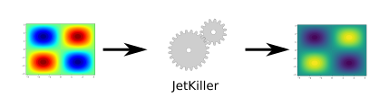
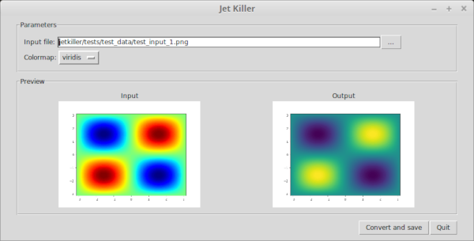

# Jet Killer

Jet Killer converts images using the "jet" colormap to a better
one (by default "viridis") by using directly the pixel values,
without any knowledge about the underlying data.

It can be used as a tool to enhance data visualizations for which
the original dataset is unavailable. Use cases include:

* enhancing figures from sources who made an unfortunate
  colormap choice,
* enhancing graphs for which the original data may be lost,
* enhancing visualizations without having to regenerate it from the
  original dataset.




## Installation

To install and use Jet Killer, Python 3 is required.

The following command installs the `jetkiller` command
and the `jetkiller` package:

```
pip3 install jetkiller
```

For details and alternative installation methods,
read the [user guide](docs/user_guide.md).


## Basic Usage

### With the GUI

To launch the GUI, use the following command:

```
jetkiller --gui
```




### From the Command Line

Use the following command to convert `input_file` to `output_file`:

```
jetkiller input_file output_file
```

For more details, read the [user guide](docs/user_guide.md).

### From Python

To convert images, import the `jetkiller` package and
use the `jetkiller.convert_file` function:

```python
import jetkiller
jetkiller.convert_file("input_image.png", "output_image.png")
```

For more details, read the [user guide](docs/user_guide.md).

## Documentation

The reference documentation is the [user guide](docs/user_guide.md).

## Release History

All releases of this project are listed on the tag page of this
repository.

See [CHANGES.md](CHANGES.md) for more details on the content of each release.


## Development Roadmap

The standalone version of Jet Killer is considered as complete
and will not have any major new features.

Here are a few ideas on how to further improve the user experience:

- develop an extension for GIMP (probably with Python-Fu)
- develop an extension for Inkscape (probably using Python)


## Versioning

Jet Killer attempts to follow the [Semantic Versioning
Specification](https://semver.org/spec/v2.0.0.html) for its version
numbers.


## License

Jet Killer is distributed under the MIT License. See
[LICENSE-MIT](LICENSE-MIT) for more details.
